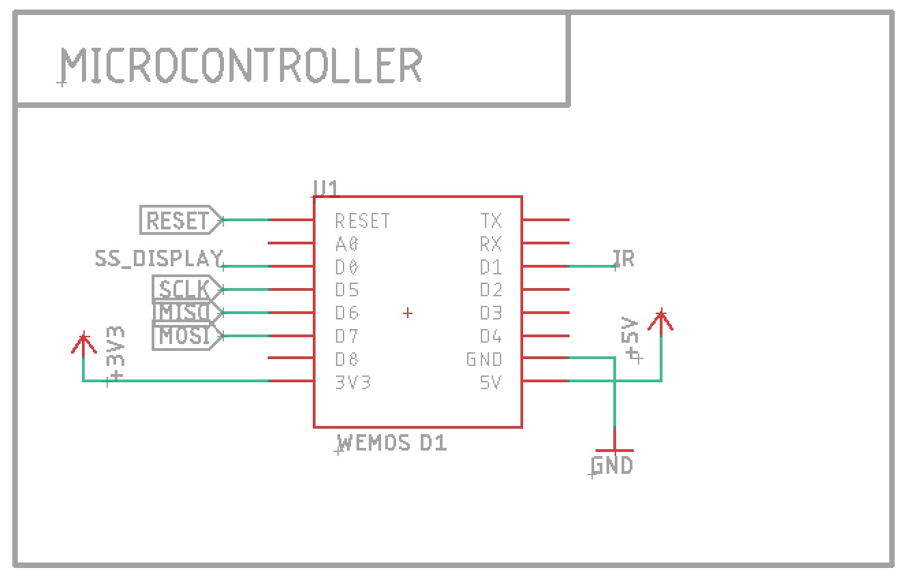

# Control a network-enabled speaker with a TV remote control

You may be interested in this project if:

* You have a speaker or Hi-Fi set using the Yamaha MusicCast or Samsung Multiroom protocols
* You have one of its inputs connected to a TV digital output
* You want to control the speaker via the same remote control of your TV
* Your TV disables volume control when the audio goes to the digital output
* Your TV remote control is based on infrared (IR) signals

## Description

Modern TVs can output their audio signal to digital output (optical/TOSLINK or RCA) instead of their internal speakers, so a user can use bigger speakers or e.g. a Dolby surround system. When doing so, a TV may ignore the volume controls because it expects the audio device to have its own volume control. The user has then to use two remote controls, one for the TV, one for the other device. This can be undesirable: it's annoying enough to find the TV remote in the couch while watching TV on a dark room. The user might just want to use the same traditional volume controls (up/down/mute) and use the other remote control for other tasks.

In the case of a Samsung Multiroom device, there's no physical remote control but a companion app that controls it via Wi-Fi. To change the volume it's then necessary to have a smartphone nearby and use the phone's volume controls. This may require you to unlock the phone, open the app and swipe on the screen. That's too many steps if you want to quickly turn the volume down.

This project is my attempt to improve the user experience by allowing the same TV remote control to also control a network-enabled speaker. It intercepts the IR signals from the TV remote control, and controls the speaker via its REST API while the TV is ignoring them.

The speaker may accept multiple inputs (Bluetooth, tuner, phono etc.), and it may be necessary to set the right input before using it for the TV. This device can listen to the press of an unused button on the TV remote (e.g. TV/radio select) to select the TV input.

## Features

* It listens to IR signals and sends HTTP requests.
* It supports IR remote controls using the NEC IR protocol.
* It supports speakers or amplifiers using Samsung Multiroom and Yamaha MusicCast protocols.
* WiFi watchdog: resets itself if local wi-fi connection is lost;
* MDNS/Bonjour: auto-discovery of the speaker IP address on the network; optionally a name can be provided to connect to a specific speaker;
* Speaker watchdog: checks periodically that the speaker is still available at that address, and reset itself otherwise;
* Volume and status output to a 7-segment display.

### Buttons

* The volume up/down buttons are recognized and work as expected.
* Same for the Mute button. It toggles the mute state.
* The TV/Radio button is repurposed it to set the speaker to select the TV input. I chose that one because I almost never watch broadcast TV.
    * On MusicCast devices, this button also powers up the device if in standby and selects the B speaker set. This can be changed in source code.

Samsung Multiroom devices may go on standby after 8 hours, and won't play any audio after that. To leave standby, just press any of the buttons above.

## Hardware

At the very essential you'll need the following:
* Wemos D1 Mini or an equivalent ESP8266-based board;
* A TSOP1738 IR receiver, plus:
    * A 100Ω resistor
    * A 4.7uF electrolytic capacitor
* A level shifter:
    * As an integrated module like [Adafruit's](https://www.adafruit.com/product/757)
    * As individual components:
        * 1x BSS138
        * 2x 10kΩ resistors

Schematic:

This is the bare minimum to get you up and running. It will receive IR signals from the remote and forward to the amplifier.

### Display

Then, you can add a four-digits LED seven-segment display. It will show the device status and the volume as you press the buttons.

There are two options: one using an all-in-one display module based on TM1637 like [this one from Robotdyn](https://robotdyn.com/4-digit-led-display-tube-7-segments-tm1637-50x19mm.html) and one using a MAX7219 and four common-cathode 7-segment displays.

#### TM1637 all-in-one

The microcontroller can be directly connected to this module. Super easy.

#### MAX7219 DIY

Connect each `DIGx` wire of J1 to the cathode of each digit, and each `SEGx` of J2 to the same segment in all digits. The wiring is pretty much arbitrary (fit for an old display PCB I made years ago and wanted to reuse), it can be changed at your convenience, with corresponding changes to `board.h`.

You'll need three more level shifters like the one for the IR; the Adafruit module provides four.

## Firmware

The firmware is based on [PlatformIO](https://platformio.org). A little configuration (see below) and a `pio run -t upload` should be enough to download the required libraries and build the firmware.

## Configuration

Create a file `src/wifi_credentials.h` to enter your Wi-Fi crendentials. See details in `src/wifi.cpp`.

In `config.h` file you can configure the IR commands and speaker protocol to use.

## IR codes

The firmware is compatible with my LG smart TV remote control. The following buttons are recognized:

* Volume up
* Volume down
* Mute
* TV/Radio

To use a different remote control, open the serial monitor and look at the IR codes that are sent when you press the desired buttons. Then change the constants in `config.h` accordingly.
